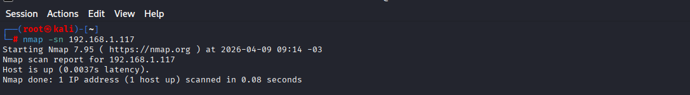
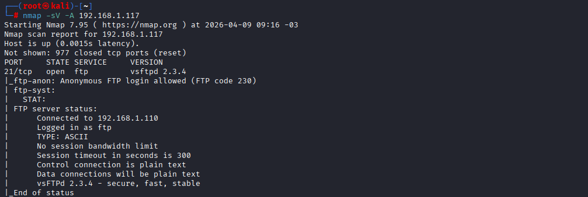

## Scope

Target IP: 192.168.1.117  
Environment: Local Lab (Metasploitable 2)

# Lab 01 - Network Discovery and Service Enumeration

---

## Objective

The purpose of this lab is to identify active hosts within the network and enumerate exposed services on the target system.

---

## Step 1 - Host Discovery

```bash
nmap -sn 192.168.1.117
```

### Explanation

The `-sn` flag performs a host discovery scan by sending ICMP requests to determine whether the target system is online, without performing a port scan.

### Real-World Relevance

This technique is commonly used during the reconnaissance phase of a penetration test to identify live hosts before conducting further analysis.

### Evidence



---

## Step 2 - Service Enumeration (Basic)

```bash
nmap -sV 192.168.1.117
```

### Explanation

The `-sV` flag enables service version detection, allowing identification of the software and versions running on open ports.

### Findings

The scan revealed multiple open ports and associated services, including:

* FTP (vsftpd 2.3.4)
* HTTP (port 80)
* SMB (port 445)

### Real-World Relevance

Identifying service versions is critical for mapping potential vulnerabilities, as attackers can correlate versions with known exploits.

### Evidence



---

## Step 3 - Advanced Enumeration

```bash
nmap -sV -A 192.168.1.117
```

### Explanation

The `-A` option enables advanced scanning features, including operating system detection, script execution, and traceroute.

### Findings

Additional information was gathered, including:

* Operating system fingerprinting
* Extended service details
* Script-based enumeration results

### Real-World Relevance

Advanced enumeration provides deeper insight into the target environment, allowing for more precise attack planning and vulnerability identification.

### Evidence
 

---

## Vulnerability Identified

The FTP service is running:

* vsftpd 2.3.4

This version is known to contain a backdoor vulnerability that can allow unauthorized remote access.

---

## Disclaimer

This lab was conducted in a controlled environment for educational and ethical testing purposes only.
